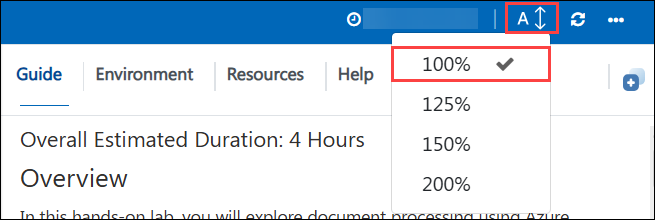
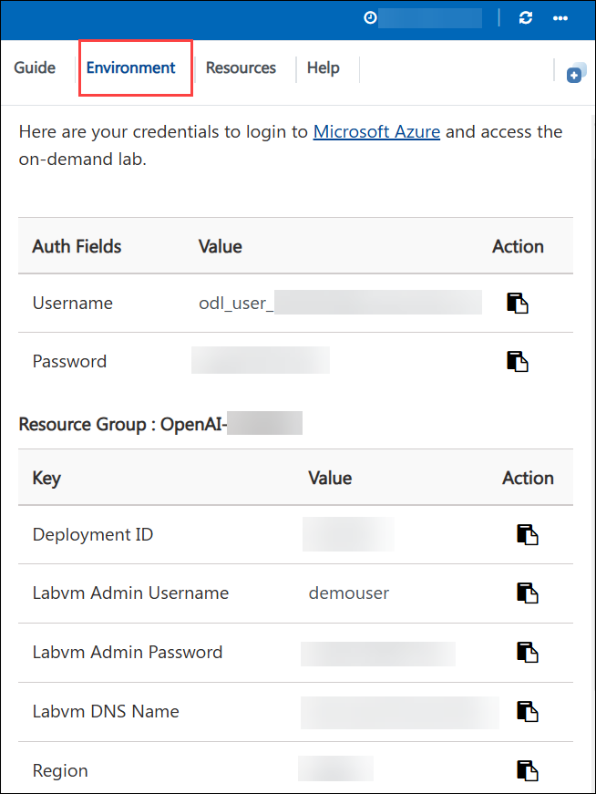
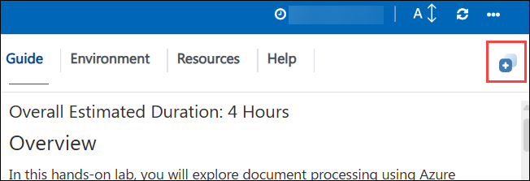
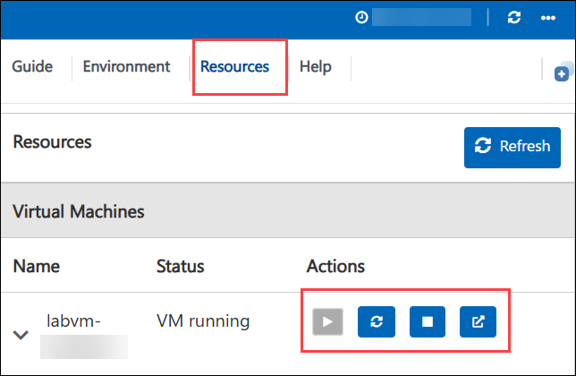
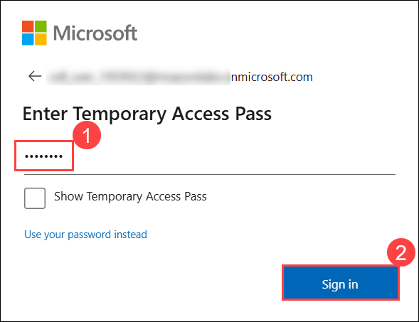
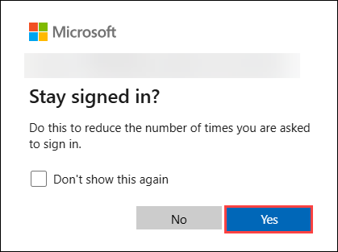

# Chat with your data Fabric

## Overall Estimated Duration: 4 Hours

## Overview

In this hands-on lab, you will explore how to design and deploy agentic AI applications using Microsoft’s Unified Data Foundation (UDF) solution accelerator. The lab guides you through combining Microsoft Fabric, Azure AI, containerized microservices, and orchestration workflows to build intelligent, production-ready agentic solutions.

By the end of the workshop, you will gain a clear understanding of how structured data, enterprise analytics, and LLM-powered agents come together to enable next-generation enterprise applications.

## Objectives

- **Building and Deploying a Fabric-Integrated AI Application on Azure :** In this hands-on lab, participants will provision and configure Microsoft Fabric for Copilot and data agents, deploy Azure infrastructure using Bicep and Azure Developer CLI, set up application authentication, and validate an end-to-end solution by querying and visualizing data through natural language interactions.

- **Creating Fabric Data Agent and Publish to Teams :** In this hands-on lab, participants will learn how to create a Microsoft Fabric Data Agent connected to a Lakehouse, build and configure a custom AI agent in Microsoft Copilot Studio, integrate both agents, and publish the solution to Microsoft Teams to enable natural language, data-driven business insights.

## Prerequisites

Participants should have:

- A basic understanding of Microsoft Azure and resource groups
- Familiarity with Microsoft Fabric, especially workspaces, capacities, and Lakehouse concepts
- Awareness of Copilot and AI features in Microsoft Fabric, including data agents and natural language querying
- Basic knowledge of command-line tools, including Azure CLI and Azure Developer CLI (azd)
- Familiarity with GitHub and GitHub Codespaces for source control and cloud-based development environments

## Architecture

This lab showcases an end-to-end agentic AI solution using **Microsoft Fabric** and **Copilot Studio** for conversational data insights. Enterprise data is stored in OneLake and exposed through a Fabric SQL Database, enabling a Fabric Data Agent for governed access. The agent is integrated with Copilot Studio to deliver insights via Microsoft Teams, while a custom agent backend using Azure App Service and Microsoft Agent Framework supports web-based interactions. This architecture demonstrates secure, scalable, multi-channel AI-driven analytics.

## Architecture Diagram

## Getting Started with the lab

Welcome to your Chat with your data Fabric Workshop. Let's begin by making the most of this experience.

## Accessing Your Lab Environment

Once you're ready to dive in, your virtual machine and **Guide** will be right at your fingertips within your web browser.

## Lab Guide Zoom In/Zoom Out

To adjust the zoom level for the environment page, click the **A↕ : 100%** icon located next to the timer in the lab environment.

## Virtual Machine & Lab Guide

Your virtual machine is your workhorse throughout the workshop. The lab guide is your roadmap to success.

## Exploring Your Lab Resources

To get a better understanding of your lab resources and credentials, navigate to the **Environment** tab.

## Utilizing the Split Window Feature

For convenience, you can open the lab guide in a separate window by selecting the **Split Window** button from the Top right corner.

## Managing Your Virtual Machine

Feel free to **Start, Stop, or Restart (2)** your virtual machine as needed from the **Resources (1)** tab. Your experience is in your hands!

## Let's Get Started with Azure Portal

1. On your virtual machine, click on the **Azure Portal** icon.

    

1. You'll see the **Sign into Microsoft Azure** tab. Here, enter your credentials:

   - **Email/Username:** <inject key="AzureAdUserEmail"></inject>

     

1. Next, provide your Temporary Access Pass:

   - **Temporary Access Pass:** <inject key="AzureAdUserPassword"></inject>

     

1. If prompted to stay signed in, you can click **Yes**.

        

1. If a **Welcome to Microsoft Azure** pop-up window appears, simply click **Cancel** to skip the tour.

      

1. If you see the pop-up **You have free Azure Advisor recommendations!**, close the window to continue the lab.  

## Support Contact

The CloudLabs support team is available 24/7, 365 days a year, via email and live chat to ensure seamless assistance at any time. We offer dedicated support channels tailored specifically for both learners and instructors, ensuring that all your needs are promptly and efficiently addressed.

Learner Support Contacts:

- Email Support: [cloudlabs-support@spektrasystems.com](mailto:cloudlabs-support@spektrasystems.com)
- Live Chat Support: https://cloudlabs.ai/labs-support

Click **Next** from the bottom right corner to embark on your Lab journey!

Now you're all set to explore the powerful world of technology. Feel free to reach out if you have any questions along the way. Enjoy your workshop!