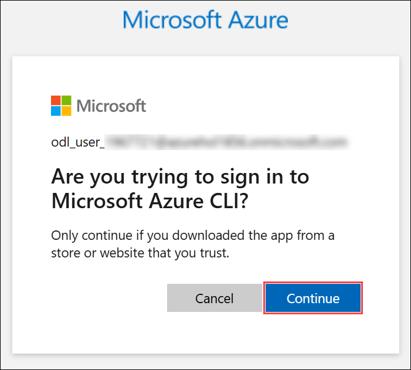
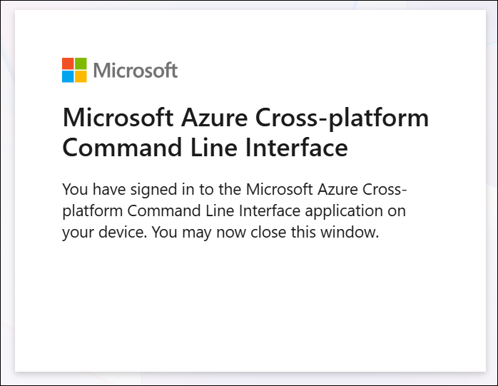
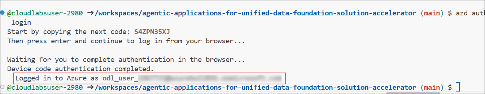
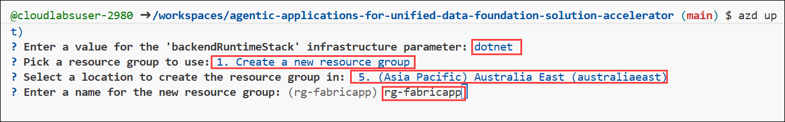
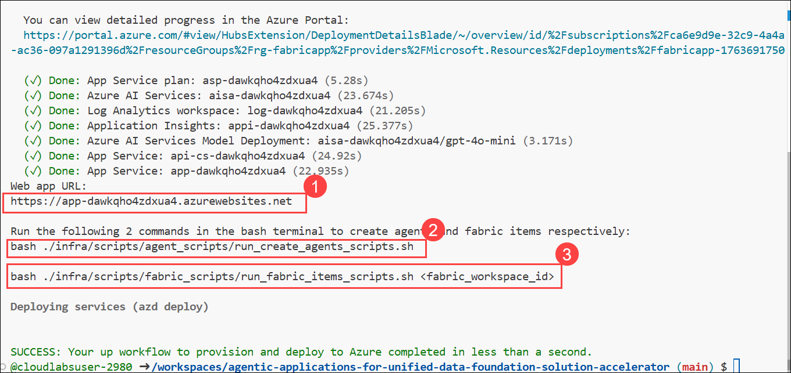
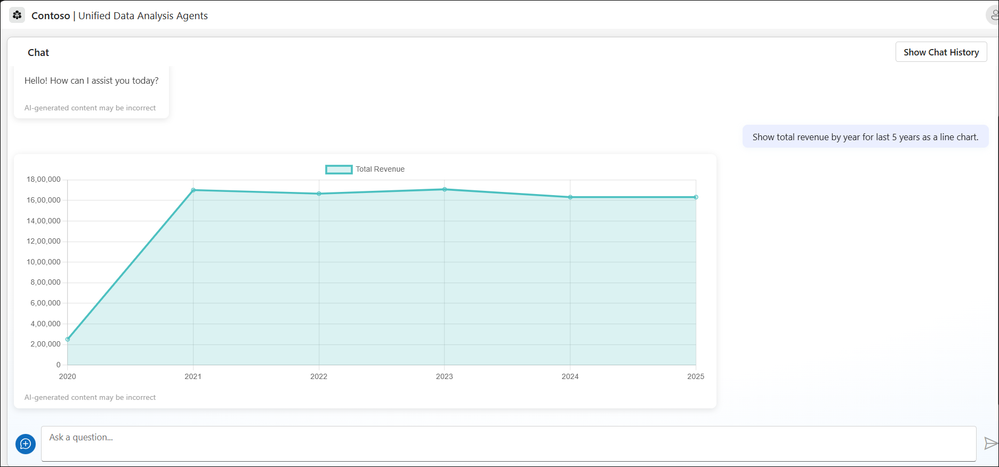
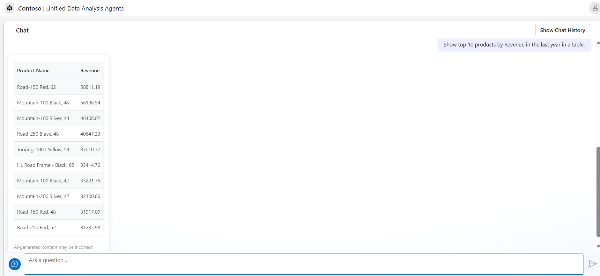

# Lab 01: Deployment & Environment Setup

## Estimated Duration: 120 Minutes

## Overview

In this lab, you will explore 

## Architecture Diagram

   

## Lab Objectives

You will be able to complete the following tasks:

- Task 1: Fabric Deployment
- Task 2: Deploy Azure infrastructure via the provided Bicep templates
- Task 3: Set up Azure OpenAI, Container Registry, Azure Container Apps and validate deployment via portal and CLI


## Task 1: Create a workspace and link with Fabric Copilot-enabled capacity

In this task, you will create a new workspace in Microsoft Fabric to organize and manage your data and analytics assets. The workspace will be linked to a Copilot-enabled capacity, providing access to AI-powered features such as natural language queries and intelligent data insights.

1. On the Lab VM, open **Microsoft Edge** from the desktop. In a new tab, navigate to **Microsoft Fabric** by copying and pasting the following URL into the address bar:

   ```
   https://app.fabric.microsoft.com/home
   ```

2. On the **Enter your email, we'll check if you need to create a new account** tab, you will see the login screen, in that enter the following **email/username (1)**, and click on **Submit (2)**.
 
   - **Email/Username:** <inject key="AzureAdUserEmail"></inject>
 
     
 
3. Now enter the following **password (1)** and click on **Sign in (2)**.
 
   - **Password:** <inject key="AzureAdUserPassword"></inject>
 
     
     
1. If you see the pop-up **Stay Signed in?**, select **Yes**.

   

1. On **Welcome to the Fabric view** dialog opens, click **Cancel**.

   

1. On **Microsoft Fabric (Free) license assigned** dialog appears, click **OK** to proceed.

   

1. You will be navigated to the **Microsoft** **Fabric Home page**.

   

   >**Note:** If you receive any pop-ups, please **Close** them.

   

1. Now, let's create a workspace with a Fabric license. Select **Workspaces** **(1)** from the left navigation bar. Click **+ New workspace (2)** found at the bottom of the pop-out menu.

    

1. The **Create a workspace** dialog opens on the right side of the browser.

1. Enter the name **fabric<inject key="DeploymentID" enableCopy="false"/> (1)**, validate that the name is available, and then click **Advanced (2)**.

    >**Note:** Please use the workspace name provided above.

    

1. Ensure **Fabric capacity (1)** is chosen, verify that **capacity<inject key="DeploymentID" enableCopy="false"/> - <inject key="Region" enableCopy="false"/> (2)** is selected under **Capacity**, and then click **Apply (3)**.

    

    >**Note:** Close any pop-up that appears on the screen.

    

1. Retrieve Workspace ID from URL for future steps.

1. The easiest way to find your workspace ID is in the URL of the Fabric site for an item in a workspace. The Fabric URL contains the workspace ID, which is the unique identifier after **/groups/** in the URL, for example: [**11aa111-a11a-1111-1abc-aa1111aaaa**](https://app.fabric.microsoft.com/groups/11aa111-a11a-1111-1abc-aa1111aaaa/list?experience=fabric-developer)
.

    

1. Copy the **Workspace ID** from the link and keep it in notepad for future reference.

## Task 2: Login to GitHub

1. Navigate to the **Environment (1)** tab in the lab environment and click on the **Licenses (2)** button. Copy the **GitHub UserEmail (3)** and **GitHub Password (4)**, then save these credentials in **Notepad**. You will need them later during the GitHub login and device verification steps.

   

1. Open a **Private window** in Microsoft Edge by clicking the three-dot menu **(1)** in the top-right and selecting **New InPrivate window (2)**.

   

1. In a new browser tab, go to `https://www.github.com/login`.

1. Enter your **GitHub Username (1)** and **GitHub Password (1)** (as saved in Notepad) and click **Sign in (2)** to proceed.

   

1. Open a new tab in InPrivate window, then go to `http://outlook.office.com/`.

   

1. Enter your **GitHub Username (1)** (as saved in Notepad) and click **Next (2)** to proceed.

   

1. Enter your **GitHub Password (1)** (as saved in Notepad) and click **Sign in (2)**.

   

1. If you see the pop-up **Stay Signed in?**, select **No**.

   

1. Check your email inbox and copy the **Verification code** sent by GitHub.

   
   
1. On the **Device verification** pane, enter the **Device Verification Code (1)** that was emailed to you and click **Verify (2)**.

   
   
   > **Note:** If you see **Two-factor authentication (2FA) is required for your GitHub account** page next, click on **Remind me tomorrow**
   
      

## Task 3: Deploy Azure infrastructure via the provided Bicep templates

You can run the solution using GitHub Codespaces. The button will open a web-based VS Code instance in your browser:

1. Open the solution accelerator by copying the below link into new tab of edge browser:

    [](https://codespaces.new/CloudLabsAI-Azure/agentic-applications-for-unified-data-foundation-solution-accelerator)

1. Accept the default values on the create Codespaces page, choose **Create codespace**.

1. It would take 2-5 minutes for codespace to get ready.

### Deploying with AZD

Once you've opened the project in [Codespaces](#github-codespaces) you can deploy it to Azure by following these steps:

1. Login to Azure:

    ```shell
    azd auth login
    ```
1. You will see Start by copying the next code: xxxxx, copy the code for you then select **Enter**.

1. A new window **Enter code to allow access** will open in the browser, provide the code copied in the previous step and choose **Next**.

1. Select the ODL user used to login into azure. If not logged into azure yet, use the following credentials to login in.

1. You'll see the **Sign into Microsoft Azure** tab. Here, enter your credentials:

   - **Email/Username:** <inject key="AzureAdUserEmail"></inject>

     

   - **Temporary Access Pass:** <inject key="AzureAdUserPassword"></inject>

     

1. You will see the pop up window, **Are you trying to sign in to Microsoft Azure CLI?**, choose **Continue**.

     

1. You will see the pop up window confirming the sign in as **You have signed in to the Microsoft Azure Cross-platform Command Line Interface application on your device.**

     

1. Navigate to the browser where codespace is created, you will notice that you are logged in as Azure user.

     

1. Provision and deploy all the resources:

    ```shell
    azd up
    ```

1. Provide an `azd` environment name as **fabricapp**.

     

1. You will see the subscription available for you, **type 1** choose **Enter** to select the default subscription.

1. Now, you will see the list of locations, use the up/down arrow button to navigate to **Australia East** as location, press **Enter** to select it.

1. You will see two options to choose the programming language for the backend API, as **Enter a value for the 'backendRuntimeStack' infrastructure parameter:**, choose **dotnet** and press **Enter**.

   - **python**
   - **dotnet(.NET )**

1. Now, you will see the option to choose the Resource group or create it, keep the curson at **1. Create a new resource group** and press **Enter**.

1. Use the up/down arrow button to navigate to **Australia East** as location, press **Enter** to select it.

1. You will see the prompt **Enter a name for the new resource group**, provide **rg-fabricapp** as suggested and press **Enter**

     

1. This deployment can take upto *7-10 minutes* to provision the resources in your account and set up the solution with sample data.
   
    > **Note:** If you encounter an error or timeout during deployment, changing the location may help, as there could be availability constraints for the resources.
    Here are some example regions where the services are available: **East US, East US2, Australia East, UK South, France Central.**

1. Once the deployment has completed successfully,
- Copy the **Web app URL (1)** and keep it in notepad for future refrence
- Copy the **two bash commands (2)** from the terminal (ex. 
`bash ./infra/scripts/agent_scripts/run_create_agents_scripts.sh` and
`bash ./infra/scripts/fabric_sripts/run_fabric_items_scripts.sh <fabric-workspaceId>`) for later use.

     

1. Run the bash script from the output of the azd deployment. The script will look like the following:

    ```Shell
    bash ./infra/scripts/agent_scripts/run_create_agents_scripts.sh
    ```

1. Run the bash script from the output of the azd deployment. Replace the **fabric-workspaceId** with your Fabric workspace Id created in the previous steps. The script will look like the following:

    ```Shell
    bash ./infra/scripts/fabric_scripts/run_fabric_items_scripts.sh <fabric-workspaceId>
    ```

1. Once the script has run successfully, go to the deployed resource group, find the App Service, and get the app URL from `Default domain`.

## Task 4: Set Up Authentication in Azure App Service

In this task, you will configure Azure App Registrations for a front-end application.

1. Search for app services in azure portal and select it.

1. You will see two app services in running state. Select the app service without **cs** in the name of it.

1. Click on `Authentication` from left menu under Settings.

    

2. Click on `Add identity provider` to see a list of identity providers.

    

3. Click on `Identity Provider` dropdown to see a list of identity providers. Select the first option `Microsoft` from the drop-down list

     

4. Provide the name of App registration as  **fabric-app**. In `client secret expiration` under **App registration** choose **Recommended 180 days**.

    

5. Accept the default values and click on `Add` button to go back to the previous page with the identity provider added.

    

6. You have successfully added app authentication, and now required to log in to access the application.

1. Navigate to Overview of the app service, select the default domain to open the web app in different tab of the browser.

1. You will see Permission requested tab, choose Accept to login in using the same user used to logged into Azure.

## Task 5: Testing the application

To help you get started, here are some **Sample Questions** you can ask in the app:

- Show total revenue by year for last 5 years as a line chart.

    

- Show top 10 products by Revenue in the last year in a table.

    

- Show as a donut chart.

    

These questions serve as a great starting point to explore insights from the data.