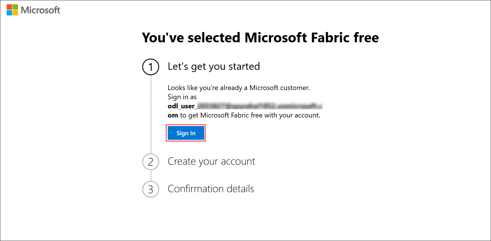
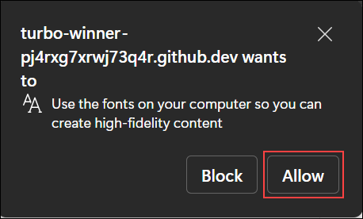
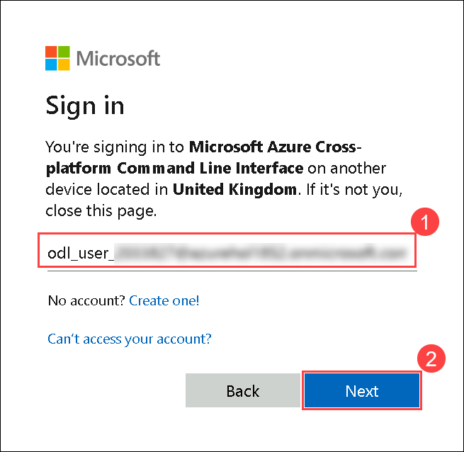

# Lab 01: Building and Deploying a Fabric-Integrated AI Application on Azure

## Estimated Duration: 120 Minutes

## Overview

In this lab, you will create a Fabric workspace linked to a Copilot-enabled capacity. You will then deploy the required Azure infrastructure using Bicep templates and Azure Developer CLI (azd), set up application authentication in Azure App Service, and validate the end-to-end solution by interacting with the deployed application to query and visualize data using natural language.

## Lab Objectives

You will be able to complete the following tasks:

- Task 1: Create a fabric workspace and link with Fabric Copilot-enabled capacity
- Task 2: Deploy Azure infrastructure via the provided Bicep templates
- Task 3: Set Up Authentication in Azure App Service
- Task 4: Testing the application

## Task 1: Create a workspace and link with Fabric Copilot-enabled capacity

In this task, you will create a new workspace in Microsoft Fabric to organize and manage your data and analytics assets. The workspace will be linked to a Copilot-enabled capacity, providing access to AI-powered features such as natural language queries and intelligent data insights.

1. In a new tab, navigate to **Microsoft Fabric** by copying and pasting the following URL into the address bar:

   ```
   https://app.fabric.microsoft.com/home
   ```

2. On the **Enter your email, we'll check if you need to create a new account** tab, you will see the login screen, in that enter the following **email/username (1)**, and click on **Submit (2)**.
 
   - **Email/Username:** <inject key="AzureAdUserEmail"></inject>
 
     
 
3. Now enter the following **password (1)** and click on **Sign in (2)**.
 
   - **Password:** <inject key="AzureAdUserPassword"></inject>
 
     
     
1. If you see the pop-up **Stay Signed in?**, select **Yes**.

    

1. In the **You've selected Microsoft Fabric free** page, under **Let's get you started** option, choose **Sign In**.

    

1. On **Welcome to the Fabric view** dialog opens, click **Cancel**.

    

1. You will be navigated to the **Microsoft Fabric Home page**.

   

   >**Note:** If you receive any pop-ups, please **Close** them.

   

1. Now, let's create a workspace with a Fabric license. Select **Workspaces** **(1)** from the left navigation bar. Click **+ New workspace (2)** found at the bottom of the pop-out menu.

     

1. The **Create a workspace** dialog opens on the right side of the browser.

1. Enter the name **fabric<inject key="DeploymentID" enableCopy="false"/> (1)**, validate that the name is available, and then click **Advanced (2)**.

    >**Note:** Please use the workspace name provided above.

     

1. Ensure **Fabric capacity (1)** is chosen, verify that **capacity<inject key="DeploymentID" enableCopy="false"/>(2)** is selected under **Capacity**, and then click **Apply (3)**.

     

    >**Note:** Close any pop-up that appears on the screen.

     

1. Retrieve **Workspace ID** from URL for future steps.

1. The easiest way to find your workspace ID is in the URL of the Fabric site for an item in a workspace. The Fabric URL contains the workspace ID, which is the unique identifier after **/groups/** in the URL, for example: [**11aa111-a11a-1111-1abc-aa1111aaaa**](https://app.fabric.microsoft.com/groups/11aa111-a11a-1111-1abc-aa1111aaaa/list?experience=fabric-developer)
.

     

1. Copy the **Workspace ID** from the link and keep it in notepad for future reference.

## Task 2: Deploy Azure infrastructure via the provided Bicep templates

In this task, you will authenticate to GitHub and complete device verification, then use GitHub Codespaces and Azure Developer CLI (azd) to deploy the solution’s Azure infrastructure. You will sign in to Azure, run azd up to provision resources, and execute post-deployment scripts to configure agents and Fabric components.

1. Navigate to the **Environment (1)** tab in the lab environment and click on the **Licenses (2)** button. Copy the **GitHub UserName (3)** and **GitHub Password (4)**, then save these credentials in **Notepad**. You will need them later during the GitHub login and device verification steps.

     

1. Open a **Private window** in Microsoft Edge by clicking the three-dot menu **(1)** in the top-right and selecting **New InPrivate window (2)**.

    

1. In a new browser tab, go to `https://www.github.com/login`.

1. Enter your **GitHub Username (1)** and **GitHub Password (1)** (as saved in Notepad) and click **Sign in (2)** to proceed.

    

1. Open a new tab in InPrivate window, then go to `http://outlook.office.com/`.

    

1. Enter your **GitHub Username (1)** (as saved in Notepad) and click **Next (2)** to proceed.

    

1. Enter your **GitHub Password (1)** (as saved in Notepad) and click **Sign in (2)**.

    

1. If you see the pop-up **Stay Signed in?**, select **Yes**.

    

1. Check your email inbox and copy the **Verification code** sent by GitHub.

    
   
1. On the **Device verification** pane, enter the **Device Verification Code (1)** that was emailed to you and it will **Verify (2)** automatically.

    
   
    > **Note:** If you see **Two-factor authentication (2FA) is required for your GitHub account** page next, click on **Remind me tomorrow**

     

1. Open the solution accelerator by copying the below link into new tab of edge browser and login using the same GitHub credentials used in previous task:

    [](https://codespaces.new/CloudLabsAI-Azure/agentic-applications-for-unified-data-foundation-solution-accelerator)

1. Accept the default values on the create Codespaces page, choose **Create codespace**.

      

1. It would take 2-5 minutes for codespace to get ready.

      

1. Once you've opened the project in **Codespaces** you can deploy it to Azure by following these steps:

1. Run the command below to log in to Azure. When the message **Start by copying the next code** appears, copy the provided code and press **Enter**.

    ```shell
    azd auth login
    ```

      

    > **Note:** If you see the option to Allow the copy to clipboard option, choose **Allow**.

     

1. A new window **Enter code to allow access** will open in the browser, provide the code copied in the previous step and choose **Next**.

      

1. Select the ODL user used to login into azure.

      

    > **Note:** If you are not logged into azure yet or using private window, choose **Use another account** and use the following credentials to login in.
    - You'll see the **Sign into Microsoft Azure** tab. Here, enter your credentials:

        - **Email/Username:** <inject key="AzureAdUserEmail"></inject>

            

        - **Temporary Access Pass:** <inject key="AzureAdUserPassword"></inject>

            

1. You will see the pop up window, **Are you trying to sign in to Microsoft Azure CLI?**, choose **Continue**.

    

1. You will see the pop up window confirming the sign in as **You have signed in to the Microsoft Azure Cross-platform Command Line Interface application on your device.**

    

1. Navigate to the browser where codespace is created, you will notice that you are logged in as Azure user.

    

1. Execute the following command to provision and deploy the required resources.

    ```shell
    azd up
    ```

1. Provide an `azd` environment name as **fabricapp** when prompted **Enter a unique Environment name** and press **Enter**.

1. You will see the subscription available for you, **type 1** choose **Enter** to select the default subscription.

1. Now, you will see the list of locations, use the up/down arrow button to navigate to **Australia East** as location, press **Enter** to select it.

1. You will see two options to choose the programming language for the backend API, as **Enter a value for the 'backendRuntimeStack' infrastructure parameter:**, choose **dotnet** and press **Enter**.

    - **python**
    - **dotnet**

 1. For the **Enter a value for the 'usecase' infrastructure parameter**, you will see two options as below, choose **Retail-sales-analysis** option for now and press **Enter**.

    - **Retail-sales-analysis**
    - **Insurance-improve-customer-meetings**

1. Now, you will see the option to choose the Resource group or create it, keep the cursor at **1. Create a new resource group** and press **Enter**.

1. Use the up/down arrow button to navigate to **Australia East** as location, press **Enter** to select it.

1. You will see the prompt **Enter a name for the new resource group**, provide **rg-fabricapp** as suggested and press **Enter**

    

1. This deployment can take upto **7-10 minutes** to provision the resources in your account and set up the solution with sample data.

    

    > **Note:** If you encounter an error or timeout during deployment, changing the location may help, as there could be availability constraints for the resources.
    Here are some example regions where the services are available: **East US, East US2, Australia East, UK South, France Central.**

1. Once the deployment has completed successfully:

    - Copy the **two bash commands (2)** from the terminal (ex. 
   `bash ./infra/scripts/agent_scripts/run_create_agents_scripts.sh` and
   `bash ./infra/scripts/fabric_sripts/run_fabric_items_scripts.sh <fabric-workspaceId>`) for later use.

      

1. Run the bash script from the output of the azd deployment. The script will look like the following:

    ```Shell
    bash ./infra/scripts/agent_scripts/run_create_agents_scripts.sh
    ```

1. Copy the link as given in the output after running the script as mentioned below and copy the code:

    

1. Provide the below link into the new browser tab as copied in previous step. A new window **Enter code to allow access** will open in the browser, provide the code copied in the previous step and choose **Next**.

    ```Shell
    https://microsoft.com/devicelogin
    ```

     

1. Select the ODL user used to login into azure.

    

1. You will see the pop up window, **Are you trying to sign in to Microsoft Azure CLI?**, choose **Continue**.

    

1. You will see the pop up window confirming the sign in as **You have signed in to the Microsoft Azure Cross-platform Command Line Interface application on your device.**

    

1. Type **1** to select the subscription and they press **Enter**. Wait for the command to run successfully.

    

1. Run the bash script from the output of the azd deployment. Replace the **fabric-workspaceId** with your Fabric workspace Id created in the **Task 2 Step 13**. The script will look like the following:

    ```Shell
    bash ./infra/scripts/fabric_scripts/run_fabric_items_scripts.sh <fabric-workspaceId>
    ```

1. Upon successful execution of the script, the resulting output will appear as shown below.

    

1. If you want to switch the **backendRuntimeStack** (for example, from **Python to .NET or vice versa**), or switch the previously used **use case** (from **Retail-sales-analysis to Insurance-improve-customer-meetings or vice versa**), you must first run the two cleanup commands. After cleanup, repeat the steps starting from Task 3, Step 21.

    ```Shell
    azd down
    ```

    ```Shell
    rm -rf .azure
    ```

> **Congratulations** on completing the task! Now, it's time to validate it. Here are the steps:
> - Hit the Validate button for the corresponding task.
> - If you receive a success message, you can proceed to the next task.
> - If not, carefully read the error message and retry the step, following the instructions in the lab guide.
> - If you need any assistance, please contact us at cloudlabs-support@spektrasystems.com. We are available 24/7 to help you out.
<validation step="5d64b6bb-4a04-4b87-b94f-faa5389bad0e" />

## Task 3: Set Up Authentication in Azure App Service

In this task, you will enable authentication for the Azure App Service by adding Microsoft as an identity provider, creating a new app registration, and validating secure user sign-in through the app’s default domain.

1. Search for app services in azure portal and select it.

    

1. You will see two app services in running state. Select the app service named **app-xxxxxxx**.

    

1. Click on `Authentication (1)` from left menu under Settings. Then, choose `Add identity provider (2)` to see a list of identity providers.

    

3. Click on `Identity Provider` dropdown to see a list of identity providers. Select the first option `Microsoft (1)` from the drop-down list.

4. Keep **App registration type** as **Create new app registration (2)**. Provide the name of App registration as  **fabric-app-<inject key="DeploymentID" enableCopy="false"/> (3)**. In `client secret expiration` under **App registration** choose **Recommended 180 days (4)**. Accept the default values and click on **Add (5)** button to go back to the previous page with the identity provider added.

    

6. You have successfully added app authentication and now required to log in to access the application.

1. Navigate to Overview of the app service, select the default domain to open the web app in different tab of the browser.

    

1. You will see Permission requested tab, choose **Accept** to login in using the same user used to logged into Azure.

    

    >**Note:** If the web application prompts for login, use the same Azure credentials you used earlier, i.e.

     - **Email/Username:** <inject key="AzureAdUserEmail"></inject>

     - **Password:** <inject key="AzureAdUserPassword"></inject>

## Task 4: Testing the application

In this task, you will validate the deployed application by submitting natural language queries and reviewing the generated visualizations. Using sample prompts, you will test the app’s ability to retrieve data, perform analysis, and display results through charts and tables.

To help you get started, here are some **Sample Questions** you can ask in the app:

- Show total revenue by year for last 5 years as a line chart.

    

- Show top 10 products by Revenue in the last year in a table.

    

- Show as a donut chart.

    

These questions serve as a great starting point to explore insights from the data.

## Summary

In this lab, you have completed:

- Created a fabric workspace and link with Fabric Copilot-enabled capacity
- Deployed Azure infrastructure via the provided Bicep templates
- Set Up Authentication in Azure App Service
- Tested the application

## You have successfully completed the exercise. Click on Next >> to proceed with the next exercise.

