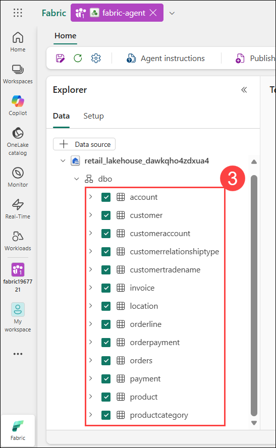
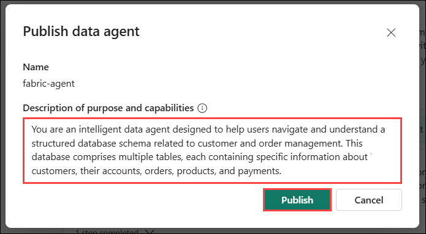
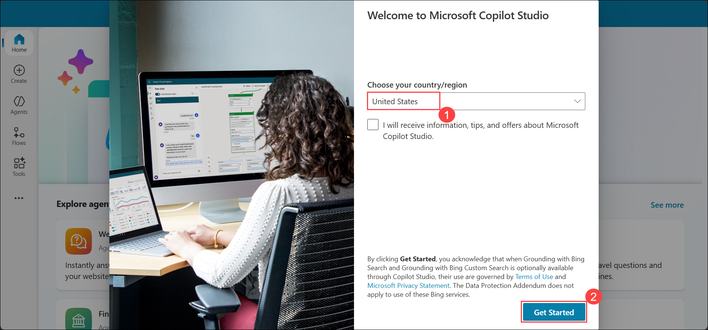
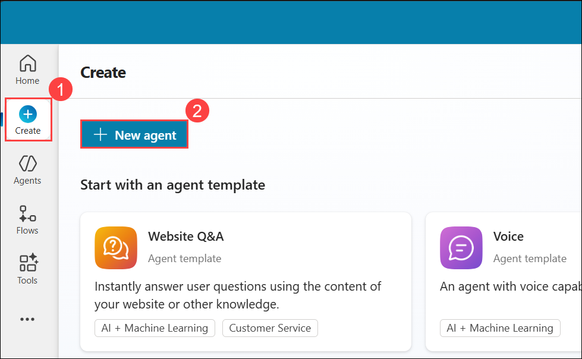
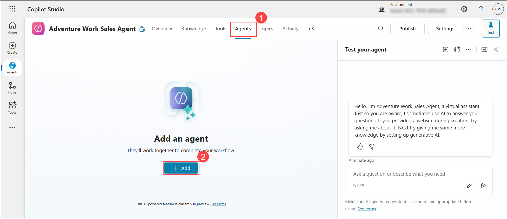
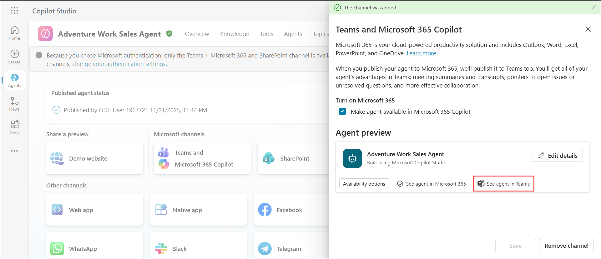

# Lab 01: Create Fabric Data Agent and Publish to Teams

## Estimated Duration: 120 Minutes

## Overview

In this lab, you will explore 

## Architecture Diagram

   

## Lab Objectives

You will be able to complete the following tasks:

## Pre-requisites
- A [paid F2 or higher Fabric capacity](https://learn.microsoft.com/en-us/fabric/enterprise/fabric-features#features-parity-list)  , or a [Power BI Premium per capacity (P1 or higher)](https://learn.microsoft.com/en-us/fabric/enterprise/licenses#workspace) capacity with Microsoft Fabric enabled
- [Fabric data agent tenant settings](https://learn.microsoft.com/en-us/fabric/data-science/data-agent-tenant-settings) is enabled.
- [Copilot tenant switch](https://learn.microsoft.com/en-us/fabric/data-science/data-agent-tenant-settings) is enabled.
- [Cross-geo processing for AI](https://learn.microsoft.com/en-us/fabric/data-science/data-agent-tenant-settings) is enabled.
- [Cross-geo storing for AI](https://learn.microsoft.com/en-us/fabric/data-science/data-agent-tenant-settings) is enabled.


## Task 1: Create a new Fabric data agent

1. To create a new Fabric data agent, first navigate to **fabric<inject key="DeploymentID" enableCopy="false"/> (1)** workspace created in previous lab, and then select the **+ New Item (2)** button. In the **All items** tab, search for **data agent (3)** to locate the appropriate option, then choose **Data agent (preview) (4)**

    

2. Provide **fabric-agent** name for your Fabric data agent and click on **Create** button.

    

3. Click on **+ Data Source (1)** and select the **Lakehouse (2)** and and select the relevant tables, for now we will select **all tables**.

    

    

    

4. Add the description of agent:

    ``` 
    You are an intelligent data agent designed to help users navigate and understand a structured database schema related to customer and order management. This database comprises multiple tables, each containing specific information about customers, their accounts, orders, products, and payments.
    ```

5. Click on `Publish` to publish the data agent.

    

4. Then, you can start asking questions.

## Task 2: Create a new Copilot Studio agent

1. In a new tab, navigate to **Microsoft Copilot Studio** by copying and pasting the following URL into the address bar:

   ```
   https://copilotstudio.microsoft.com/
   ```
1. You will see **Welcome to Microsoft Copilot Studio** page, choose the Country/region as **United States (1)** then click on **Get started (2)** button.

    

2. On the left pane, select **Create (1)**, then select **+ New agent (2)** to start building your custom AI agent.

    

3. Configure your agent by giving the name and description provided below that describes its purpose and role then choose **Create (3)**.

    | Setting | Value |
    | --- | --- |
    | Name  | **Adventure Work Sales Agent (1)** |
    | Description | **Adventure Work Sales Agent is a custom agent built in Microsoft Copilot Studio and is designed to answer business questions about customers and product sales (2)** |

    

4. To add a Fabric data agent to your custom AI agent in Copilot Studio, navigate to **Agents (1)** from the top pane and then select **+ Add (2)** to add agents to your custom AI agent.

    

5. Select **Choose to an external agent** then choose **Microsoft Fabric (Preview)** from the Choose how you want to extend your agent category.

    ![microsoft-copilot-studio-add-fabric]../Images/microsoft-copilot-studio-add-fabric.png)

6. If there's already a connection between Microsoft Fabric and the custom AI agent, you can select Next and move to next step. Otherwise, select the dropdown and select Create new connection to establish a connection between Microsoft Fabric and Copilot Studio.

    

7. From the list of Fabric data agents you have access to, select the data agent that you want to connect to the custom AI agent in Copilot Studio and select Next. The selected data agent works together with the custom AI agent to handle specific workflows.

    

8. You can adjust the description for the Fabric data agent that you select and then select **Add and configure**. This step adds the Fabric data agent to the custom AI agent in Microsoft Copilot Studio.

    

9. Once done, navigate back to the Agents from the top pane and you should see the Fabric data agent among the agents that are connected to the custom AI agent.
    

10. Select the connected Fabric data agent. Under additional details, you can optionally decide the authentication of the Fabric data agent to be the User authentication or Agent author authentication. If you select User authentication as the authentication, you need to ensure that users have access to the Fabric data agent and its underlying data sources.
    

11. You could use the built-in test chat pane on the right to ask questions and get answers. This helps you to validate the performance of the custom AI agent to ensure it invokes the connected Fabric data agents to get answers and further fine-tune its behavior.

12. Ensure that you have enabled generative AI orchestration. To do this, select Settings that is located on the top of the chat pane and under Orchestration, select the first one.

    

    Scroll down and turn off `Use general knowledge` under Knowledge:
    


13. You can publish the custom AI agent and then navigate to the Channels to select your desired consumption channel.

    

    

14. To publish to Teams, select **Teams and Microsoft 365 Copilot** from the list of channels. This opens the window on right. Select **Add channel** to enable this channel. Once done, the See agent in Teams are active. You can select it, which prompts you to open Microsoft Teams.

    

    

15. This will then launch Microsoft Teams where you can ask questions from the custom AI agent and get answers.


## Sample Questions 
1. Total number of customers


2. Total number of orders in the last 6 months by region

