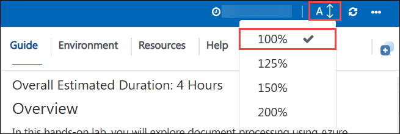
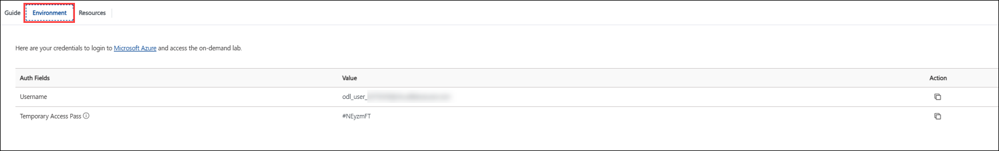
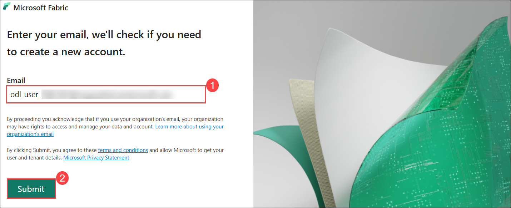
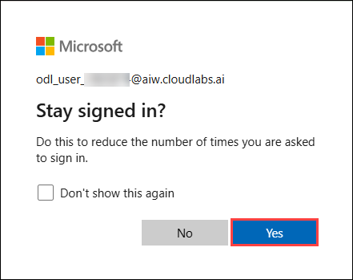
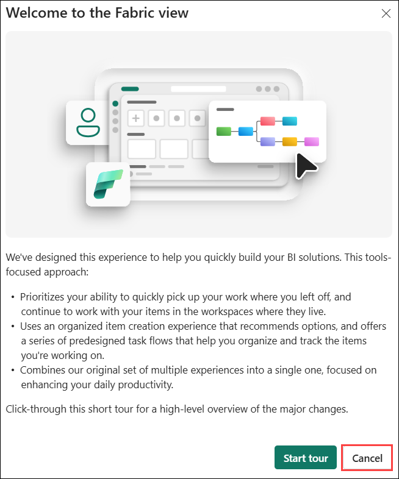
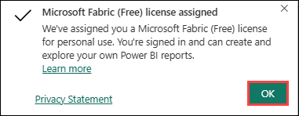
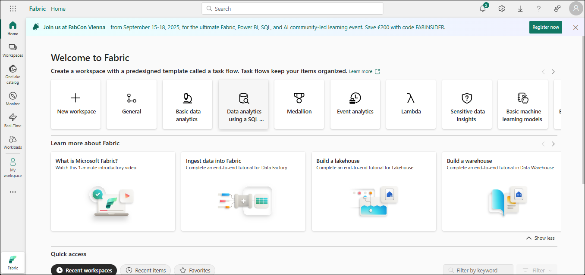
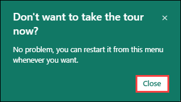
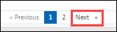

# Fueling AI and operational decision making with Fabric Real-Time Intelligence

## Overall Estimated Duration: 4 Hours

## Getting Started with the lab

Welcome to your Fueling AI and operational decision making with Fabric Real-Time Intelligence Workshop. Let's begin by making the most of this experience.

## Accessing Your Lab Environment

Once you're ready to dive in, your **Guide** will be right at your fingertips within your web browser.


## Lab Guide Zoom In/Zoom Out

To adjust the zoom level for the environment page, click the **A↕ : 100%** icon located next to the timer in the lab environment.



## Exploring Your Lab Resources

To get a better understanding of your lab resources and credentials, navigate to the **Environment** tab.



## Let's Get Started with Fabric Portal
 
1. On the Lab VM, open **Microsoft Edge** from the desktop. In a new tab, navigate to **Microsoft Fabric** by copying and pasting the following URL into the address bar:

   ```
   https://app.fabric.microsoft.com/home
   ```

2. On the **Enter your email, we'll check if you need to create a new account** tab, you will see the login screen, in that enter the following **email/username (1)**, and click on **Submit (2)**.
 
   - **Email/Username:** <inject key="AzureAdUserEmail"></inject>
 
       
 
3. Now **Enter Temporary Access Pass** and click on **Sign in**.
 
   - **Temporary Access Pass:** <inject key="AzureAdUserPassword"></inject>
 
       
     
1. If you see the pop-up **Stay Signed in?**, select **Yes**.

   

1. On **Welcome to the Fabric view** dialog opens, click **Cancel**.

   

1. On **Microsoft Fabric (Free) license assigned** dialog appears, click **OK** to proceed.

   

1. You will be navigated to the **Microsoft** **Fabric Home page**.

   

   >**Note:** If you receive any pop-ups, please **Close** them.

   

## Support Contact

The CloudLabs support team is available 24/7, 365 days a year, via email and live chat to ensure seamless assistance at any time. We offer dedicated support channels tailored specifically for both learners and instructors, ensuring that all your needs are promptly and efficiently addressed.

Learner Support Contacts:

- Email Support: [cloudlabs-support@spektrasystems.com](mailto:cloudlabs-support@spektrasystems.com)
- Live Chat Support: https://cloudlabs.ai/labs-support

Click **Next** from the bottom right corner to embark on your Lab journey!




Now you're all set to explore the powerful world of technology. Feel free to reach out if you have any questions along the way. Enjoy your workshop!
